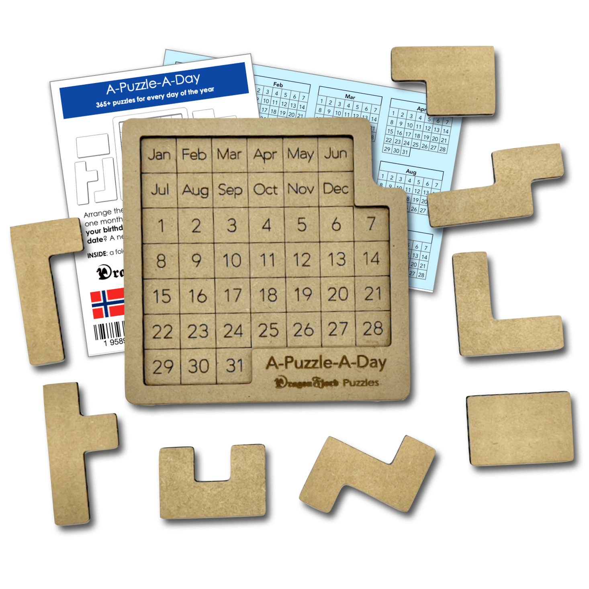

# Puzzle Solver

This repository contains a generic tetris like puzzle solver in python, and a (little less) generic tetris like puzzle solver in C++.

Four examples of puzzle solvers are provided with the python implementation, all using the generic puzzle.py and solver.py files.

These four examples of puzzles are :
- Poodle Puzzle Daily Calendar Puzzle
- Dragon Fjord Puzzle-A-Day
- Jarring Words Calendar Puzzle
- HEMA square puzzle

Moreover, and because python implementation is 182 times slower than the C++ implementation, the python solver.py also have a multiprocesses version, badly named : multithreadssolver.py

## Used Solving strategy

Unlike all the other codes made to solve these puzzles I saw, this code is not "brut force" at all, and avoid tying any obviously impossible position.

This code is not running imbricated loops with X and Y size of the puzzle, to try to fit the pieces, but is instead looking for the first available square from top left, and then recursively try to fit all remaining pieces on this square. Each time a piece fits, the recursive function is called with a board containing this newly fitted piece, and a list of pieces from which this placed piece has been removed. If the list of pieces to fit runs empty, the board is a solution. If the piece to fit cannot be put on the next available square of the board, the recursive call ends, and returns, to let the recursive algorithm keep on running on other branches (try other pieces on this square).

Pieces and their rotations are defined such as no isomorphic transformation remains, to avoid getting the same solution twice or more. The python code automatically detects isomorphic transformations of pieces (the C++ one doesn't).

Board is stored as an array and pieces as lists of vectors, each vector giving the coordinates to go from a square of the piece to another one (until we have gone through all squares of the piece).
Due to this, a piece of a single square would be defined by an empty vectors list (such piece doesn't exist in the puzzles given here).

Object oriented design is used : piece and board are classes.

## Poodle Puzzle Daily Calendar Puzzle Solver

This code is designed to solve this Daily Calendar Puzzle:

It's a Tetris like puzzle you need to solve differently for each day because the pieces have to fit in a grid with one square for each of the 12 months, each of the 31 days and each of the 7 days of week. Once solved, the Tetris pieces hide every squares except one for the current month, one for the current day of the month and one for the current day of the week.

This code implement the same algorithm in python and C++, even if it is a little bit more flexible and generic in its python version.

I first started with the python version, but as it requires 76 minutes to find all the solutions for one date, I tried to speed it up by using several threads, and finally, as I needed to speed it up a lot, I implemented it again, and optimized it in C++. As a result, the computation time for the same task dropped from 76 minutes to 25 seconds.

The python code has been splitted into its generic and specific parts to provide support for other puzzles, but the C++ one hasn't, even if it almost could (the Board class constructor only is strongly binded to this specific puzzle).

Python implementation ask for the date of the puzzle to solve in a prompt.

C++ implementation takes the date in command line with 3 numbers : 

 1. week day number from 1 to 7
 2. month day number from 1 to 31 
 3. month number from 1 to 12.

C++ implementation can also print all solutions of one date in a single line formatted to be readable with python json library (option 'i'), turn upside down some pieces when looking for solutions (add the list of pieces numbers from 1 to 10 as arguments), or use back side of the pieces as base one (option "s").

This repository also contains Linux and Windows makefiles for the C++, and a bash script able to run 12 threads to look for all the solutions for 7x12x31 dates on a multicore system by using the C++ implementation, and make it print the solutions in 12 files (one for each month).

Here is an example of the python multiprocesses solver execution on a 4 cores CPU with only front side of pieces is used:

    Start solving puzzle for Monday, 27 March 2023
    End of process 3 after 0:00:00 with 0 sol. found using 162 tries and putting 1 pieces
    End of process 1 after 0:00:00 with 0 sol. found using 162 tries and putting 1 pieces
    End of process 5 after 0:01:32 with 0 sol. found using 111514 tries and putting 1945 pieces
    
    Solution found by process 6 in 0:01:38 after testing 120279 combinations and putting 2373 pieces:
     _ _ _ _ _ _
    |_  |_|_   _|
    | |_ _ _| | |_
    | |_  | |_|_  |
    | | | |_ _ _|_|
    |_| |_ _|  _  |
    | |_ _ _|_|_|_|
    |_ _ _ _|_|   |
            |_ _ _|

    End of process 9 after 0:01:39 with 0 sol. found using 123200 tries and putting 2331 pieces
    End of process 6 after 0:03:26 with 1 sol. found using 307472 tries and putting 6268 pieces
    End of process 8 after 0:03:38 with 0 sol. found using 327234 tries and putting 5894 pieces
    End of process 4 after 0:03:44 with 0 sol. found using 243148 tries and putting 3929 pieces
    End of process 2 after 0:05:43 with 0 sol. found using 533550 tries and putting 8909 pieces
    End of process 0 after 0:06:02 with 0 sol. found using 581714 tries and putting 10140 pieces
    End of process 7 after 0:09:00 with 0 sol. found using 798072 tries and putting 14973 pieces
    1 solutions found for Monday, 27 March 2023 in 0:09:02.944981 after 3026228 tries and placing 54391 pieces

The multiprocesses implementation creates one process for each piece, and each process looks for all the solutions with this piece on the top leftmost square.

And here is an example of the C++ implementation use for the same date on the same CPU:

    $./poodlepuzzleDailyCalendarSolver.bin 1 27 3
    Solutions:
     _ _   _ _ _
    |_  |_|_   _|
    | |_ _ _| | |_
    | |_  | |_|_  |
    | | | |_ _ _|_|
    |_| |_ _|  _  |
    | |_ _ _|_|_|_|
    |_ _ _ _|_|   |
            |_ _ _|
    
    1 solutions found after 3026228 tries for Monday 27  March
    End of program reached,  execution duration: 9 seconds

This date have been chosen for the example above because it has only one solution using pieces forsted only.

It is possible to improve the solving speed ([this solver](https://github.com/StevHenry/calendar-puzzle) is 2.5 times faster than this implementation, even if it can't display the solutions, but only count them),
This implementation is intentionally not fully optimize to have better readability and genericity.

## Dragon Fjord Puzzle-A-Day Solver

This solver is a python one based on the common puzzle.py and solver.py/multithreadsolver.py used for the other puzzles solvers.

The Dragon Fjord puzzle corresponding to this solver is this one:

## Jarring Words Calendar Puzzle Solver

This solver is a python one also based on the common puzzle.py and solver.py/multithreadsolver.py used for the other puzzles solvers.

The Jarring Words puzzle corresponding to this solver is this one:

This puzzle is very similar to Dragon Fjord one, only the "T" shaped piece differs from it (Dragon Fjord version have a big S piece instead the T one)

## HEMA square Puzzle

It is a simple square board in which tetris like pieces must fit.

The version created to implement this solver is this one:

